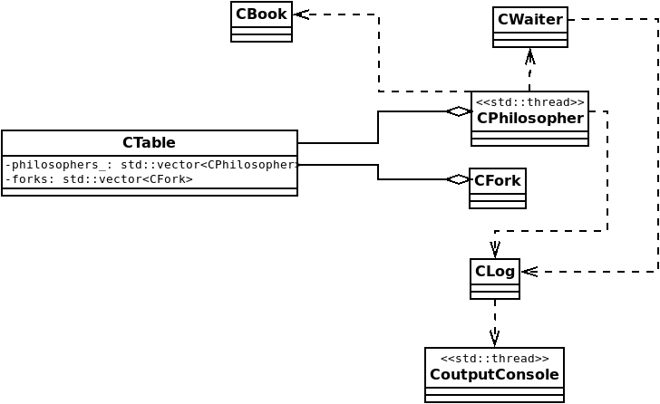

# Hardcore-Dining-Philosophers

Extended version of Dining Philosopher problem

## 1.0 Architecture

*CTable* - contains two vectors of philosophers and forks.
It is responsible for init and end.

CPhilosooher - A thread with life-cycle of philosopher function.
It contains reference to its forks ie. "F0-F1".
This class writes its activity to CLog.
It asks CWaiter if can eat at specified (current) time.

*CFork* - fork representation.

*CLog* - log (queue) with philosophers activities.

*CoutputConsole* - class reponsible for display log on second console.

*CBook* - class with philosophers considerations.

*Consideration* - structure with philosopher consideration.
